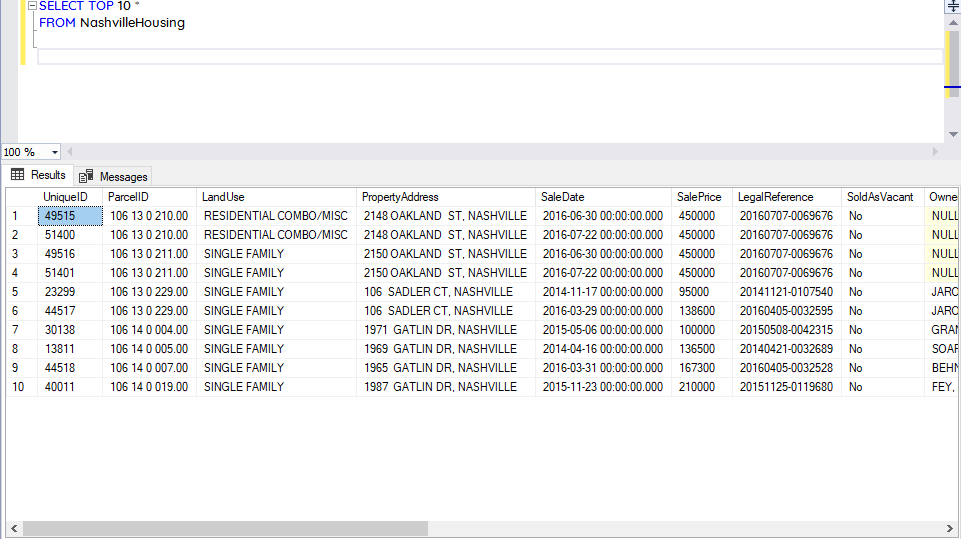
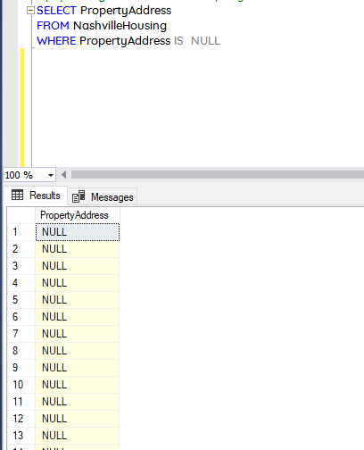
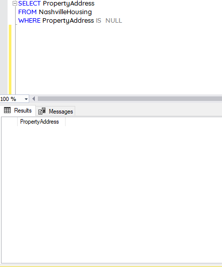
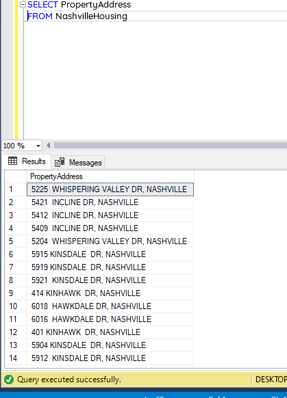
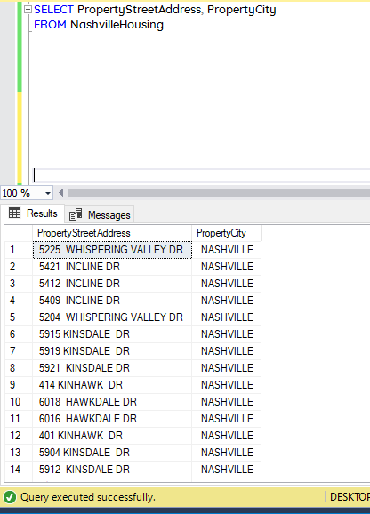
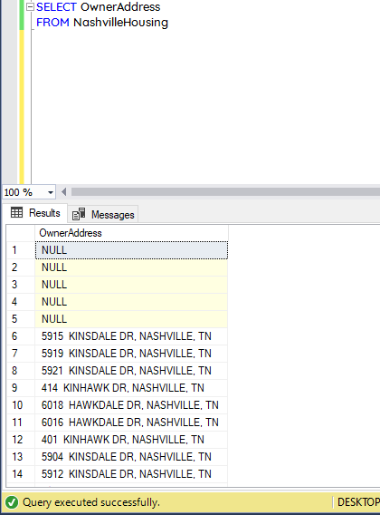
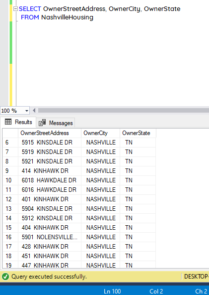
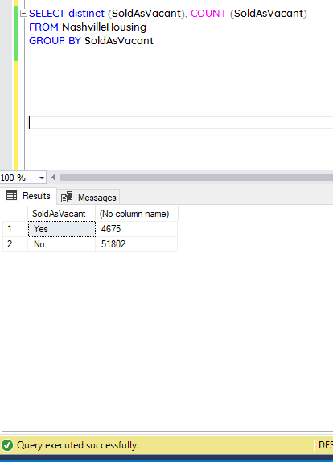
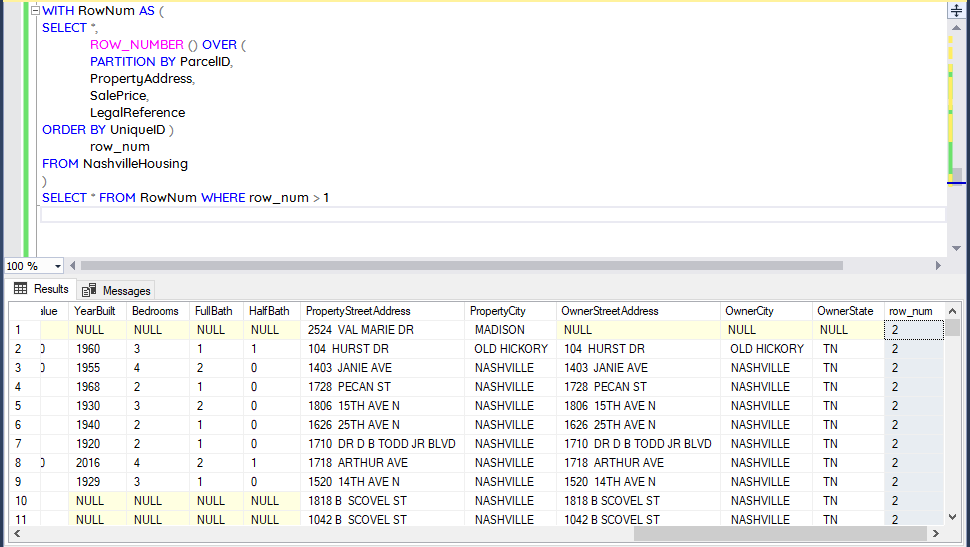
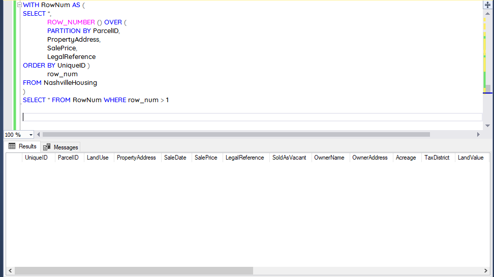

# Data Cleaning in SQL


## Introduction 

Data cleaning is a crucial step in the process of data analysis and management, as it ensures that the data being used is accurate, consistent, and reliable. In SQL, data cleaning involves the identification and correction of errors or inconsistencies in data, such as missing values, duplicate records, and incorrect formatting. This process is essential for ensuring that the data is of high quality and can be used effectively for analysis and reporting. By performing data cleaning in SQL, one can ensure that data is accurate and reliable, making it easier to make informed decisions based on the insights gained from the analysis. In this way, data cleaning is an essential aspect of any data-driven organization that seeks to maximize the value of their data.

In this project, I cleaned Nashville Housing data using SQL server management system (SSMS). The dataset is avaialbe for download [here](https://rb.gy/6su02).

## Some SQL Concepts and Functions used are:
- SELECT
- FROM
- WHERE
- ALTER TABLE
- DELETE FROM
- COMMON TABLE EXPRESSIONS (CTEs)
- CHARINDEX ()
- CONVERT ()
- PARSE ()

The dataset was downloaded as an Excel file(.xlsx) and then imported into SSMS. Then I previewed the top rows of the data to confirm if it was imported correctly. 
The image shows the preview.



## Data Processing
The following are the cleaning steps performed on the data

1. Creating a new column from **SaleDate** column called **SaleDateConverted** with Date format using the code below

```
ALTER TABLE NashvilleHousing
ADD SaleDateConverted Date;

UPDATE NashvilleHousing
SET SaleDateConverted = CONVERT(Date, SaleDate)
```
The image belows shows the output


2. Populating the records where **PropertyAddress** column is **NULL** with the correct value
```
UPDATE a
SET a.PropertyAddress = ISNULL(a.PropertyAddress, b.PropertyAddress)
FROM NashvilleHousing a
JOIN NashvilleHousing b
on a.ParcelID = b.ParcelID
AND a.[UniqueID ] <> b.[UniqueID ]
WHERE a.PropertyAddress IS NULL
```

Before Removing NULLS   | After Removing NULLS
:--------------------: | :-----------------:
 | 

3. Splitting the **PropertyAddress** column into **StreetAddress** and **City** by delimiter

First I added two new columns into the table 

```
ALTER TABLE NashvilleHousing
ADD PropertyStreetAddress NVARCHAR (255),
		PropertyCity NVARCHAR (255)
```

Then I updated the records with the split address

```
UPDATE NashvilleHousing
SET PropertyStreetAddress = SUBSTRING (PropertyAddress, 1, CHARINDEX(',', PropertyAddress)-1),
PropertyCity =  SUBSTRING (PropertyAddress, CHARINDEX(',', PropertyAddress)+1, LEN(PropertyAddress))
```
Before Splitting PropertyAddress  | After Splittting PropertyAddress
:--------------------: | :-----------------:
 | 

4. Splitting the **OwnerAddress** column using **PARSE ()** function

Adding three new columns as shown

```
ALTER TABLE NashvilleHousing
ADD OwnerStreetAddress NVARCHAR (255),
		OwnerCity NVARCHAR (255),
		OwnerState NVARCHAR (255)
```

Then updating the records with the following codes

```
UPDATE NashvilleHousing
SET OwnerStreetAddress = PARSENAME (REPLACE (OwnerAddress, ',', '.'), 3),
		OwnerCity = PARSENAME (REPLACE (OwnerAddress, ',', '.'), 2),
		OwnerState = PARSENAME (REPLACE (OwnerAddress, ',', '.'), 1)
```

Before Splitting OnwerAddress   | After Splitting OwnerAddress
:--------------------: | :-----------------:
 | 


5.	Correcting wrong records in **SoldAsVacant** column

It appears some records were incorrectly entered as ‘Y’ and ‘N’ instead of ‘Yes’ and ‘No’.

This was corrected using the code below.

```
UPDATE NashvilleHousing
SET SoldAsVacant = CASE WHEN SoldAsVacant = 'Y' THEN 'Yes'
		WHEN SoldAsVacant = 'N' THEN 'No'
		ELSE SoldAsVacant
		END
```

Before    | After
:--------------------: | :-----------------:
 | 


8. Removing duplicates records from the data
First I check for duplicates and discovered 121 records, then I removed them using the code chunk below

```
WITH RowNum AS (
SELECT *, 
			ROW_NUMBER () OVER (
			PARTITION BY ParcelID,
			PropertyAddress,
			SalePrice,
			LegalReference
ORDER BY UniqueID )
			row_num
FROM NashvilleHousing
)
DELETE FROM RowNum
WHERE row_num > 1
```
Before Removing Duplicates   | After Removing Duplicates
:--------------------: | :-----------------:
  


Finally I removed irrelevant columns from the data using the code below

```
ALTER TABLE NashvilleHousing
DROP COLUMN PropertyAddress, SaleDate, LegalReference, OwnerAddress, TaxDistrict
```


